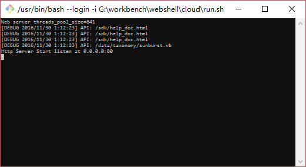
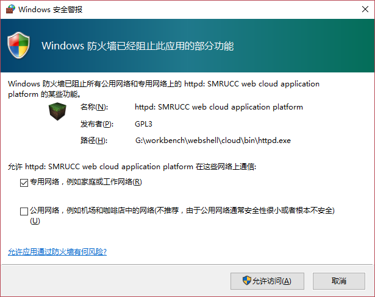

# GCModeller.WebShell
GCModeller web user interface

#### Development Dependence

+ ``sciBASIC#`` runtime
  + https://github.com/xieguigang/sciBASIC#
+ ``SMRUCC WebCloud`` web runtime
  + https://github.com/SMRUCC/SMRUCC.WebCloud
+ ``GCModeller`` bioinformatics library runtime
  + https://github.com/SMRUCC/GCModeller

#### Running the Demo

+ Run from bash: [./cloud/run.sh](./cloud/run.sh)

+ Allow the [**httpd**](https://github.com/SMRUCC/SMRUCC.WebCloud) web server pass through the firewall

+ Open your browser and navigate to [http://127.0.0.1](http://127.0.0.1)